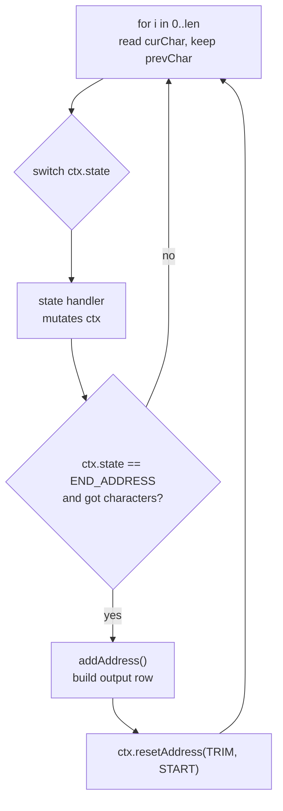
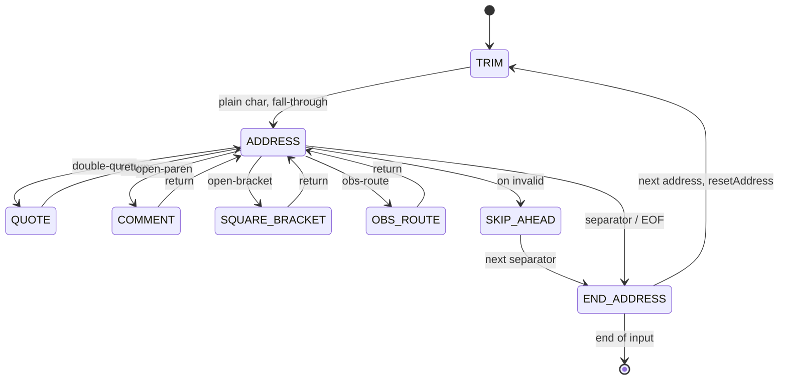

# Parser Architecture

How `Email\Parse` turns a string of addresses into parsed results. This is the
*implementation* companion to [`DESIGN.md`](DESIGN.md), which covers the RFC
*semantics* (what counts as valid and why). Here the subject is the shape of the
code: a character-by-character state machine, decomposed into a dispatch loop
over per-state handlers, backed by a per-parse context object.

## At a glance

| | |
|---|---|
| Entry points | `parseSingle()` → `ParsedEmailAddress`, `parseMultiple()` → `ParseResult`, `parseStream()` → `Generator` (plus the deprecated array-returning `parse()`) |
| Core | All entry points funnel into the private `parseInternal(string $emails, bool $multiple, string $encoding): array` |
| Model | Character-by-character state machine, 12 states |
| Core body | Setup + a `switch ($ctx->state)` dispatch loop (~185 lines) |
| State handlers | 7 methods (one per switch arm) |
| Working state | `ParseContext` — one object per parse, ~24 accumulator fields |
| Reentrancy | A fresh context per call; nothing parse-specific is stored on the `Parse` instance |

## The dispatch loop

`parse()` reads the input once, left to right. Each iteration reads one
character, dispatches on the current state to a handler that mutates the
context, and — when an address boundary is reached — commits the address and
resets for the next one.

The `TRIM → ADDRESS` transition is a genuine `switch` fall-through: a plain
character seen in the trim state *is* the first character of the address, so
control drops straight from the `TRIM` arm into the `ADDRESS` arm without
re-reading. That is why `handleStateTrim()` returns a `bool` — `true` tells the
loop to fall through.

## The states

`ADDRESS` is the hub. It runs the addr-spec walk via an inner `subState` machine
(`LOCAL_PART → DOMAIN → AFTER_DOMAIN`, plus `NAME` for display names). From the
hub the parser makes bounded *excursions* into quoted strings, nested comments,
address literals, and obsolete source routes; each returns to `ADDRESS`. A
separator or end-of-input drops to `END_ADDRESS`, which commits the address and
loops back to `TRIM`. Malformed input diverts to `SKIP_AHEAD`, which
resynchronizes at the next separator.

Each switch arm is a method, so a state's logic is isolated and independently
readable:

| State | Handler | Responsibility |
|---|---|---|
| `SKIP_AHEAD` | `handleStateSkipAhead` | Error recovery — consume until the next separator |
| `TRIM` | `handleStateTrim` | Skip leading separators/whitespace; signal fall-through |
| `ADDRESS` | `handleStateAddress` | The addr-spec walk (local-part `@` domain, display name) |
| `SQUARE_BRACKET` | `handleStateSquareBracket` | `[...]` domain / address literal |
| `OBS_ROUTE` | `handleStateObsRoute` | Obsolete `@a,@b:addr` source route |
| `QUOTE` | `handleStateQuote` | Quoted-string local-part or display name |
| `COMMENT` | `handleStateComment` | Nested `( ... )` comments |

`handleStateAddress` further delegates the per-character work to
`handleAddressWhitespace` (CFWS/folding), `handleAddressAt` (the `@` boundary),
and `handleAddressNonAtext` (punctuation and specials). `addAddress()` builds the
public output array; its shape is independent of the context object.

## ParseContext

All of the loop's working state lives on one object, `ParseContext`. A fresh
instance is created for every `parse()` call and is never stored on the `Parse`
instance. That is the whole reentrancy story: a caller-supplied
`localPartNormalizer` closure may call back into `parse()` mid-parse, and the
inner call gets its own context instead of clobbering the outer one's.

The object holds three kinds of field. The distinction matters because only the
last kind is cleared between addresses in a batch:

| Group | Lifetime | Fields (representative) |
|---|---|---|
| Input snapshot | Set once per parse, never reset | `chars[]`, `len`, `emails`, `multiple` |
| Hoisted config | Set once per parse, never reset | `separators`, `bannedChars`, `allowedWhitespace`, `useWhitespaceAsSeparator` |
| Per-address accumulator + loop control | Cleared by `resetAddress()` | `state`, `subState`, `commentNestLevel`, `originalAddress`, `localPartParsed`, `domain`, `quoteTemp`, `comments[]`, `inAngleAddr`, ... (~24 total) |

The input snapshot and hoisted config are `public readonly` constructor-promoted
properties, so a state handler cannot mutate configuration mid-parse; only the
accumulator is writable. `state` and `subState` are typed as the `ParserState`
backed enum (`src/ParserState.php`), which replaced the former `Parse::STATE_*`
integer constants: the context can never hold an out-of-range state.

## Per-address reset

`resetAddress(ParserState $state, ParserState $subState)` is the single source of truth for
clearing per-address state between addresses in a batch. It zeroes the
accumulator *and* the three loop-control fields — `state`, `subState`, and
`commentNestLevel`. Both call sites use it: the initial setup before the loop and
the reset after each committed address.

Consolidating this matters for a subtle reason. `commentNestLevel` previously had
no explicit reset at all — it stayed correct only because entering a comment with
a leading `(` reassigns the level to `1`. Any future per-address field added to
the wrong place would have silently leaked into the next address in a batch.
Routing all per-address state through one method removes that trap: a new field
has exactly one place to be cleared.

## Invariants

- **Behavior-preserving.** The decomposition changed structure only; parsing
  logic, conditions, and ordering are unchanged, and the output arrays are
  byte-identical. Gated by the full test suite, PHPStan level 8, and Psalm.
- **Reentrant.** No per-parse state on the `Parse` instance; a normalizer
  callback may re-enter `parse()` safely.
- **No performance regression.** Hard constraint on the refactor; `chars`/`len`
  are kept as loop locals (not only context properties) for hot-loop locality.
